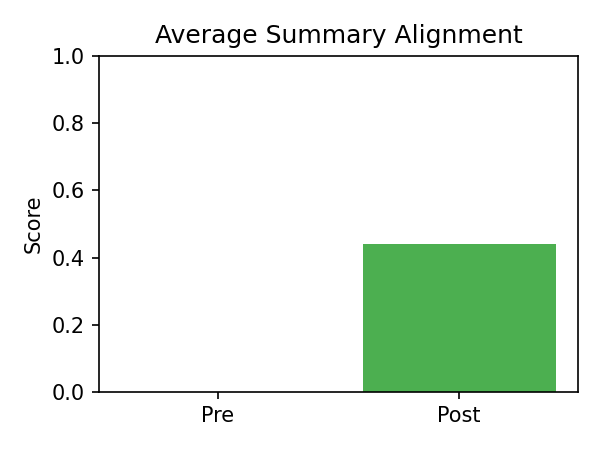

# Research Paper Analyzer
Convert research PDFs into structured JSON + evidence-backed summaries.

[](https://www.python.org/)
[](LICENSE)

 <!-- Demo GIF showing the application workflow -->

Turn long-form papers into reviewer-friendly artifacts:
- Evidence-backed summaries that cite the pages they come from.
- Automatic structure repair keeps JSON schema-valid and auditable.
- Batch tools for quick evaluation runs across multiple PDFs.

### What it does
- **Real LLMs:** Works with **Google Gemma 3N** and **DeepSeek** (via OpenRouter).
- **Grounded results:** Attaches **evidence** from the PDF for the key facts.
- **Repairs for reliability:**
  - **Structure repair**  fills obvious gaps/format issues so JSON is valid.
  - **Summary repair**  lines up each summary sentence with matching evidence (to reduce hallucinations).

### Quickstart
1. Create a virtualenv and install deps  
   ```bash
   python -m venv .venv && source .venv/bin/activate   # Windows: .venv\Scripts\activate
   pip install -r requirements.txt
   ```
2. Copy `.env.example` -> `.env` and add your keys
3. Run the app

   ```bash
   streamlit run app/app.py
   ```

### Before vs After (tiny sample)

**Before (raw JSON)**

```json
{"title":"...", "authors":[], "year":null, "summary":"...", "evidence":[]}
```

**After (repaired JSON)**

```json
{"title":"...", "authors":["A. Author"], "year":2024, "summary":"...", "evidence":[{"page":3,"text":"..."}]}
```

### Results on a small set (first pass)

|                                               Papers | Schema pass | Avg fixes | Evidence found | Summary align (pre->post) |
| ---------------------------------------------------: | ----------: | --------: | -------------: | ------------------------: |
|                                                   12 |       12/12 |       2.1 |            88% |               0.72 -> 0.91 |
| *(Will expand later; OCR for scanned PDFs planned.)* |             |           |                |                           |

### Batch Evaluation (10 PDFs)

| Papers | Schema pass | Avg fixes | Evidence found | Summary align (pre→post) |
| ------:| -----------:| --------: | -------------:| ------------------------: |
| 10     | 10/10       | 2.5       | 7/10          | 0.00 → 0.44               |



Schema pass indicates whether the final JSON validates against the project schema. Repairs count tracks how many automatic fixes were logged in `_meta.repair_log`. Evidence coverage measures the share of evidence buckets that retained at least one snippet. Summary alignment uses fuzzy sentence matching to see how well summaries are supported before and after repairs. Known limitation: scanned PDFs without a text layer are skipped.

To rerun the batch evaluation:

```bash
python -m venv .venv && source .venv/bin/activate   # Windows: .venv\Scripts\activate
pip install -r requirements.txt
python scripts/batch_eval.py pdfs --output results/batch_eval
```

### Configure

Put keys in `.env` (see `.env.example`). The UI defaults to **DeepSeek (OpenRouter)** now, but you can switch between **DeepSeek** and **Gemma 3N** directly in the app.

Key variables:
- `OPENROUTER_API_KEY` - required for any OpenRouter runs.
- `OPENROUTER_DEEPSEEK_MODEL` - DeepSeek model slug (defaults to `deepseek/deepseek-chat-v3.1:free`).
- `OPENROUTER_MODEL` - Gemma model slug (defaults to `google/gemma-3n-e4b-it:free`).

Example direct OpenRouter call (DeepSeek default shown here):

```python
import requests
import json

response = requests.post(
    "https://openrouter.ai/api/v1/chat/completions",
    headers={
        "Authorization": "Bearer <OPENROUTER_API_KEY>",
        "Content-Type": "application/json",
        # Optional ranking metadata
        "HTTP-Referer": "<YOUR_SITE_URL>",
        "X-Title": "<YOUR_SITE_NAME>",
    },
    data=json.dumps({
        "model": "deepseek/deepseek-chat-v3.1:free",
        "messages": [
            {"role": "user", "content": "What is the meaning of life?"}
        ],
    }),
)
```

To hit Gemma directly instead, swap the model slug and adjust any provider-specific constraints as needed:

```python
import requests
import json

response = requests.post(
    "https://openrouter.ai/api/v1/chat/completions",
    headers={
        "Authorization": "Bearer <OPENROUTER_API_KEY>",
        "Content-Type": "application/json",
        # Optional ranking metadata
        "HTTP-Referer": "<YOUR_SITE_URL>",
        "X-Title": "<YOUR_SITE_NAME>",
    },
    data=json.dumps({
        "model": "google/gemma-3n-e4b-it:free",
        "messages": [
            {"role": "user", "content": "Summarize the contributions in JSON."}
        ],
    })
)
```

### Demo

Short clip in `assets/demo.mp4` (or GIF). Shows: open app -> upload PDF -> view JSON + evidence.

### License

MIT � see [LICENSE](LICENSE) for full terms.
